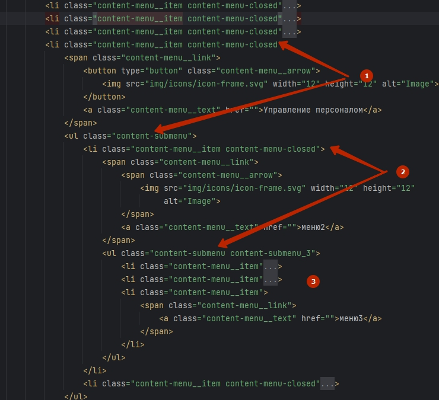
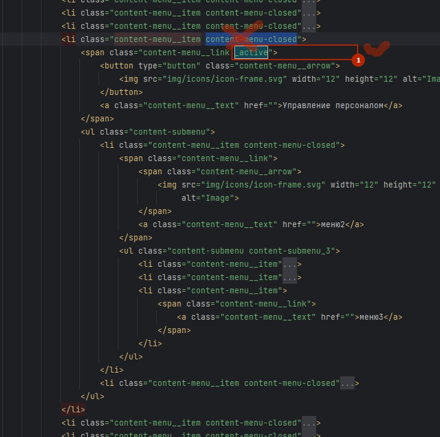
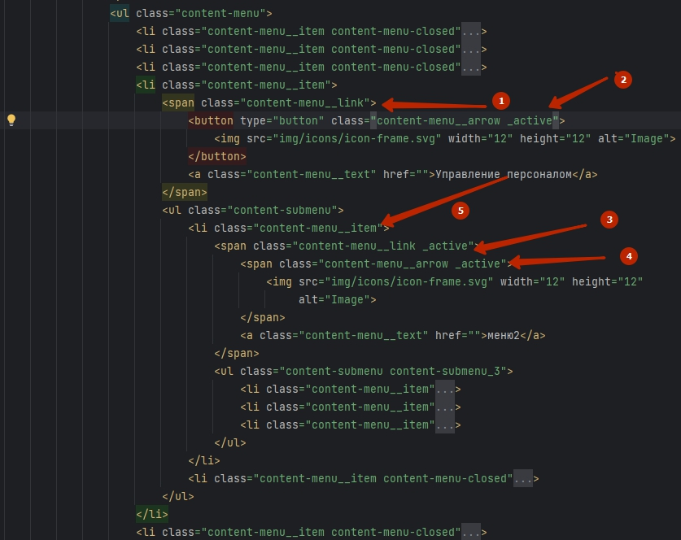
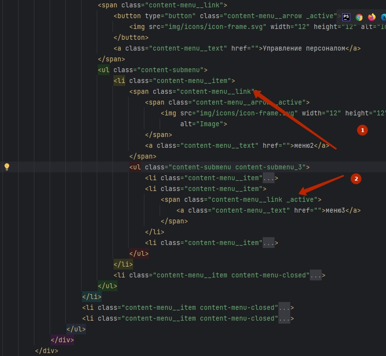
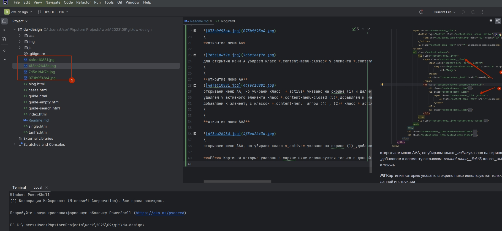

## Header
*чтобы текущая страница в шапке была выделена как на макете*
нужно добавить к .menu__item класс **_active**
>menu-item _active>

>menu-right__item _active>

В верстке на примере страницы руководства

## Минимизирования
я использую сборку **webpack+gulp** для минимизирования стилей и скриптов

## Работа содержания
*структура меню*
* **А** *меню первого уровня(на скрине 1)*
* **АА** *меню второго уровня(на скрине 2)*
* ***АА*** *меню третьего уровня(на скрине 3)*

\
**открытие меню А**

для открытия меню А убираем класс *.content-menu-closed* у элемента *.content-menu__item* активного элемента и добавляем к элементу с классом *.content-menu__link* класс *_active*
\
\
**открытие меню АА**

открываем меню АA, но убираем класс  *_active* указано на скрине (1) и далее как в скрине
удаляем у активного элемента класс *.content-menu-closed (5)*,добавляем к элементу с классом *.content-menu__link(3)* класс *_active* , а также
добавляем к элементу с классом *.content-menu__arrow (4) , (2)* класс *_active*
\
\
**открытие меню ААA**

\
открываем меню АAA, но убираем класс *_active* указано на скрине (1) ,добавляем к элементу с классом *.content-menu__link(2)* класс *_active* , а также

***PS*** Картинки которые указаны в скрине ниже используются только в данной инструкции

 +которая и есть данный скрин)
